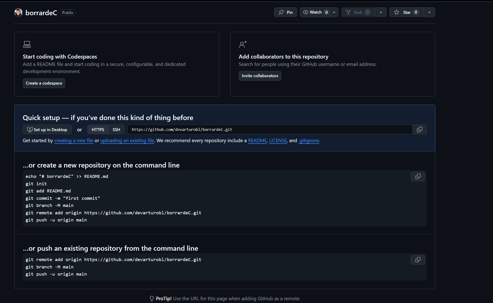

# Paso 1 Crear cuenta en github
*nota: ten a la mano despues del registro en nombre de usuario y email*

# Paso 2 Descargar git para windows
*nota: seleccionar todos los elementos de opciones y dar siguiente hasta finalizar*

# Paso 3 Ejecutar inicio de sesion en consola git
*nota en la consola de git poner los siguientes comandos aqui ocuparas el usuario y email de registro*
$ git config --global user.name "John Doe"
$ git config --global user.email johndoe@example.com

https://git-scm.com/book/es/v2/Inicio---Sobre-el-Control-de-Versiones-Configurando-Git-por-primera-vez

# Paso 4 Empezar a usar git
1. Crear una carpeta para la materia de Estructuras de datos en tu equipo
2. Colocar un archivo para tener la primera carga "Cualquier archivo"
3. Sobre la carpeta boton derecho y seleccion open git bash here
4. Iniciar git con el comando `git init` *enter*
5. Agregar el contenido al repositorio `git add .` *enter*
6. Etiquetar el cambio `git commit -m "Primera Carga"` *enter*
7. Entramos a github y creamos un repositorio nuevo aparece asi 
8. copiamos y pegamos el codigo `git remote add origin https://github.com/xxxxxx/xxxxxx.git` *enter*
9. Terminamos escribiendo `git push -u origin master` *enter*
10. Actualizamos pagina de github
